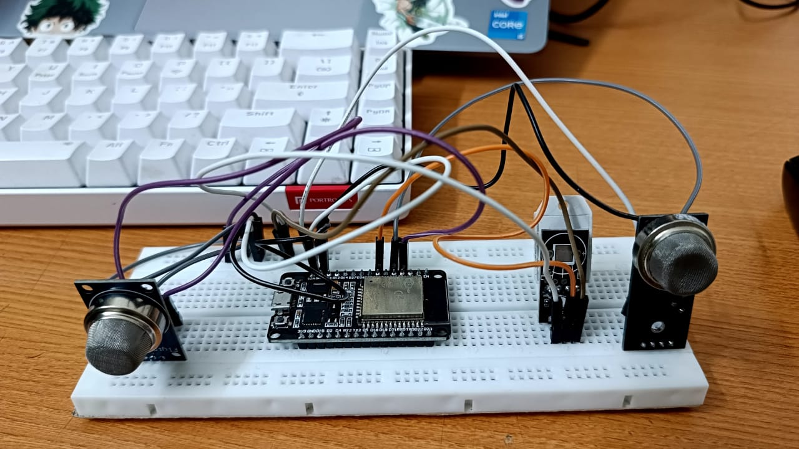
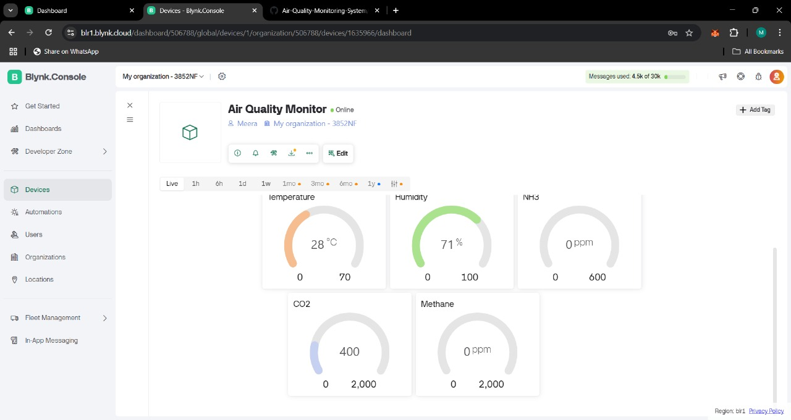

# IoT-Based Air Quality Monitoring System

This project uses NodeMCU (ESP8266) with MQ135, MQ2 gas sensors and a DHT22 sensor to monitor temperature, humidity, CO₂, NH₃, and methane levels. Real-time sensor data is transmitted to the Blynk IoT dashboard using Wi-Fi.

## 🔧 Hardware Used
- NodeMCU ESP8266
- DHT22 Sensor (Temperature & Humidity)
- MQ135 Gas Sensor (CO₂ and NH₃)
- MQ2 Gas Sensor (Methane)
- Breadboard & Jumper Wires

## 📱 IoT Platform
- **Blynk**: Used to display real-time data on mobile dashboard

## 🖥️ Arduino Code
The code (`AirQualityMonitor.ino`) reads sensor values and sends the data to Blynk using virtual pins V0–V4.

## 📸 Project Images
## Block Diagram

## Blynk Dashboard

## 📦 Future Scope
- Adding PM2.5/PM10 sensors
- Local data storage using SD card
- Auto alert system using buzzer or notification
